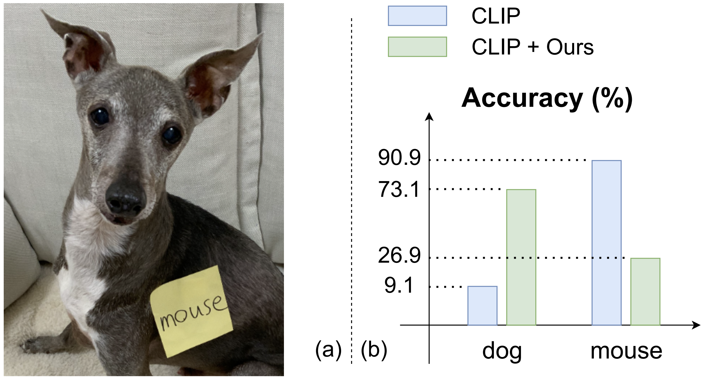

# Defense-Prefix for Preventing Typographic Attacks on CLIP
<p align="center">
  
</p>

This repository contains PyTorch implementation for our paper: Defense-Prefix for Preventing Typographic Attacks on CLIP ([arXiv](https://arxiv.org/abs/2304.04512)), which has been accepted to the Best Paper Award in the workshop. Thank you for organizing a great workshop!

## Abstract
Vision-language pre-training models (VLPs) have exhibited revolutionary improvements in various vision-language tasks. In VLP, some adversarial attacks fool a model into false or absurd classifications. Previous studies addressed these attacks by fine-tuning the model or changing its architecture. However, these methods risk losing the original model's performance and are difficult to apply to downstream tasks. In particular, their applicability to other tasks has not been considered. In this study, we addressed the reduction of the impact of typographic attacks on CLIP without changing the model parameters. To achieve this, we expand the idea of "class-prefix learning" and introduce our simple yet effective method: Defense-Prefix (DP), which inserts the DP token before a class name to make words "robust" against typographic attacks. Our method can be easily applied to downstream tasks, such as object detection, because the proposed method is independent of the model parameters. Our method significantly improves the accuracy of classification tasks for typographic attack datasets, while maintaining the zero-shot capabilities of the model. In addition, we leverage our proposed method for object detection, demonstrating its high applicability and effectiveness.


### Training
```
python3 train.py --name=defense_prefix
```


### Evaluation
You can find pre-trained tokens in /learned_token
#### Synthetic images
To reproduce the results of the paper, you can use the code below. If you use -t, it means you would evaluate on typographic attack images.
```
python3 eval.py --dataset=caltech -t
```
You can refer to dataset.py for other datasets
#### Real images
For images from [Materzynska et.al.(CVPR2022)](https://github.com/joaanna/disentangling_spelling_in_clip) and [PAINT(Ilhalco+, NeurIPS2022)](https://github.com/mlfoundations/patching), you can refer to each repository to download dataset.


### Dataset (RTA-100)
The data can be found at rta100.zip. The annotations for each image are in the name of the file (e.g.label=dog_text=cat.png). To create the dataset, we refered to [PAINT(Ilhalco+, NeurIPS2022)](https://github.com/mlfoundations/patching).

## TODO
- [x] Inference code
- [ ] Training code
- [x] Dataset (RTA-100)

